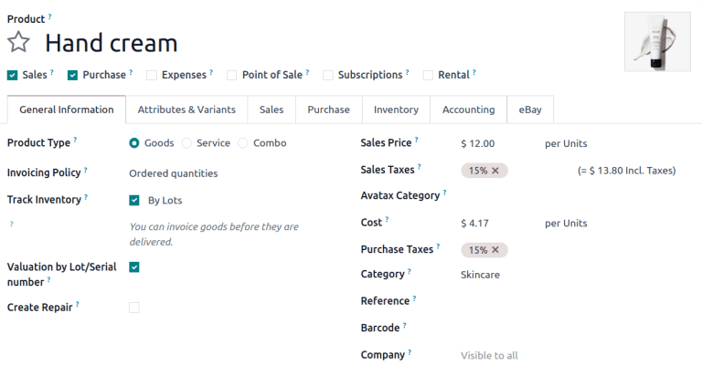
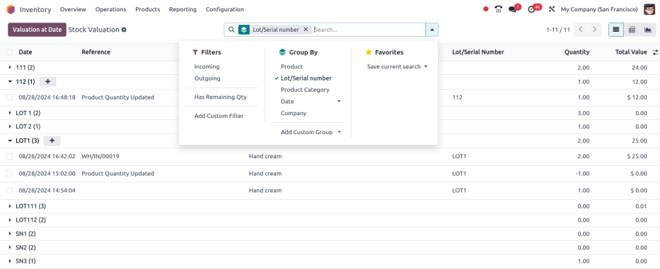
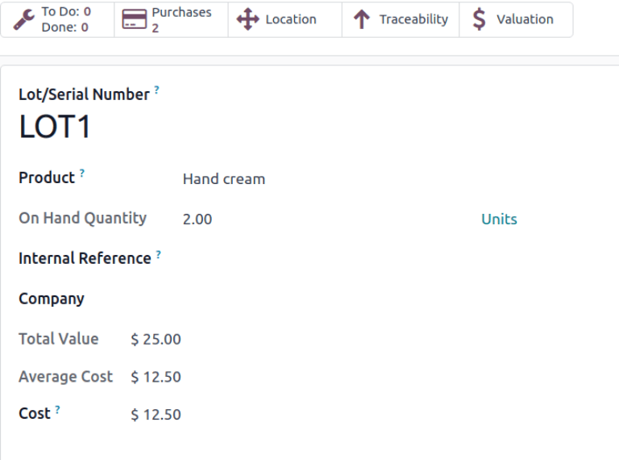

================================
Valuation by lots/serial numbers
================================

Track :doc:`inventory valuation <using_inventory_valuation>` by :doc:`lots or serial numbers
<../../product_management/product_tracking>` to:

#. Compare and differentiate purchasing cost based on lot/SN.
#. Track the actual cost of manufactured products based on the real cost of each tracked component
   used.
#. Depreciate specific lots/SNs when they :doc:`sit in stock for too long
   <../../warehouses_storage/reporting/aging>`.

Configuration
=============

To enable valuation by lots or serial numbers, begin by enabling the :ref:`Lots and Serial Numbers
feature <inventory/product_management/enable-lot-serial>`. After that, go to
:menuselection:`Inventory app --> Products --> Products` and select the desired product.

On the product form, in the :guilabel:`Category` field, choose a product category. Then, choose the
:icon:`oi-arrow-right` :guilabel:`(right arrow)` icon to open the product category's settings page.
In the :guilabel:`Inventory Valuation` section, choose the desired :guilabel:`Costing Method`.

.. seealso::
   :ref:`Costing methods <inventory/warehouses_storage/valuation-on-product-category>`

After configuring the costing method, activate the product to be tracked by lots or serial numbers
by ticking the :guilabel:`Track Inventory` checkbox. Then, click the field that becomes visible and
choose either :guilabel:`By Lots` or :guilabel:`By Unique Serial Number` from the resulting
drop-down menu.

Doing so makes the :guilabel:`Valuation by Lot/Serial number` checkbox appear below it. Tick it, and
the configuration to track valuation by lot or serial numbers is complete.

   Product form showing the Valuation by Lot or Serial Number feature

Valuation layers
================

To understand how this valuation method works, consider how the following scenarios influence the
valuation of a lot/serial number:

#. Purchase and selling products: cost is updated according to the costing method set on the
   *product category*. For more information, refer to the :ref:`Costing Methods section
   <inventory/warehouses_storage/costing_methods>`
#. Inventory adjustment to existing lot/serial number: cost = cost of the last layer of this lot
#. Inventory adjustment to create new lot/serial number: cost = cost from product form

View valuation
==============

Valuations of a lot/serial number can be viewed through the valuation report or through the
lot/serial number form page.

Valuation report
----------------

Display the valuation of lots and serial numbers in the database by going to
:menuselection:`Inventory app --> Reporting --> Valuation`.

On the :guilabel:`Stock Valuation` report, click the search bar, and in the :guilabel:`Group By`
section of the resulting drop-down menu, select :guilabel:`Lot/Serial number`.

.. tip::
   Click the :icon:`fa-plus` :guilabel:`(+)` icon to the right of a collapsed lot number line to
   :ref:`manually modify the cost <inventory/warehouses_storage/update-unit-price>`.

   This is useful for adjusting individual lot prices when a purchase order or bill includes
   multiple lots/serial numbers, as initial prices are identical upon reception.

Valuation smart button
----------------------

To access a filtered part of the *Stock Valuation* report specific to a lot or serial number, go to
:menuselection:`Inventory app --> Products --> Lots/Serial Numbers` and select the desired item.

On a lot or serial number page, turn on :ref:`developer mode <developer-mode>` and click the
:guilabel:`Valuation` smart button.

