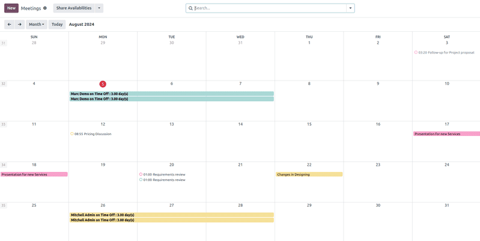
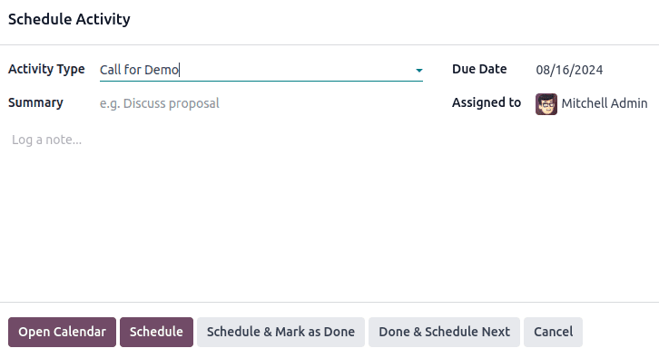
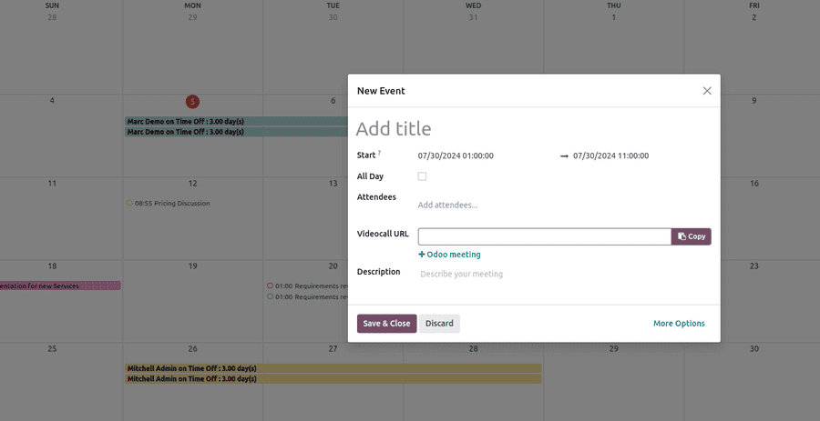
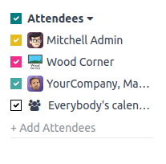
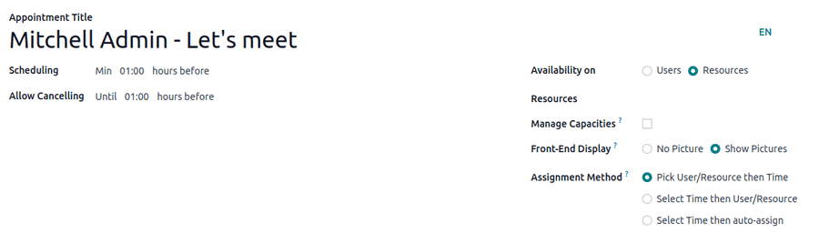
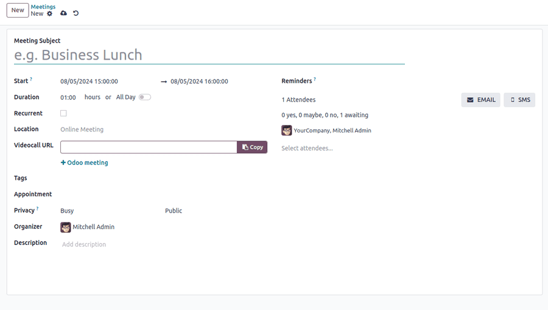

:show-content:
:show-toc:

========
Calendar
========

.. toctree::
   :titlesonly:

   calendar/outlook
   calendar/google

Odoo **Calendar** is a scheduling app that allows users to integrate a company’s business flow into
a single management platform. By integrating with the other apps in Odoo’s ecosystem, **Calendar**
allows users to schedule and organize meetings, schedule events, plan employee appraisals,
coordinate projects, and more – all from the same platform.

Upon opening the :menuselection:`Calendar app`, users have an overview of their current meetings.
The selected view option appears as a :guilabel:`Day`, :guilabel:`Week`, :guilabel:`Month`, or
:guilabel:`Year` button. Under the view options drop-down menu, users can also enable or disable
:guilabel:`Show weekends`.

.. tip::
   Depending on the selected view option, users can click the adjacent arrow buttons to switch
   between days, weeks, etc., and switch back to the current day with the :guilabel:`Today` button.

Sync third-party calendars
--------------------------

Users can sync Odoo with existing :doc:`Outlook <calendar/outlook>` and/or
:doc:`Google<calendar/google>` calendars, by heading to
:menuselection:`Calendar app --> Configuration --> Settings`. From here, enter
:guilabel:`Client ID` and :guilabel:`Client Secret`. There is also an option to pause
synchronization by ticking the checkbox, or automating synchronization by keeping it blank.

Events created in synced calendars automatically appear across the integrated platforms.

Create activities from chatter
------------------------------

Instantly create new meetings anywhere in Odoo through an individual record’s chatter, like
in a **CRM** opportunity card or task in the **Projects** app.

From the chatter, click on the :guilabel:`Activities` button. In the new
:guilabel:`Schedule Activity` pop-up window, select the desired :guilabel:`Activity Type`, which
populates a set of buttons, depending on the activity. Activities that involve other schedules,
like :guilabel:`Meeting` or :guilabel:`Call for Demo`, link to the **Calendar** app. Select one of
these activities to link to the **Calendar** app, then hit :guilabel:`Open Calendar` to navigate
back to the app. Alternatively, it is also possible to :guilabel:`Schedule & Mark as Done` to close
out the activity, or select :guilabel:`Done & Schedule Next` to keep the new activity open and
create another.

Plan an event
-------------

To put an event on the calendar, open the :menuselection:`Calendar app`, and click into the target
date. On the :guilabel:`New Event` pop-up window that appears, start by adding the event title.

The target date auto-populates in the :guilabel:`Start` field. This can be changed by clicking
into the date section, and selecting a date from the calendar. For multi-day events, select the end
date in the second field, then click :guilabel:`Apply`.

Tick the :guilabel:`All Day` checkbox if there is no specific start or end times.

For events with specific start and stop times, untick that checkbox to enable time selection, which
automatically populates in the :guilabel:`Start` section.

The signed-in user auto-populates as the first attendee. Additional attendees can be added or
created from here, as well.

For virtual meetings, copy and paste the URL into the space provided in the
:guilabel:`Videocall URL` field. Or, click :guilabel:`+ Odoo meeting` to create a link.

Once the event is created, users can click into the virtual meeting directly from the calendar
event.

The :guilabel:`Descriptions` field allows users to add additional information and details
about the meeting.

Click :guilabel:`More Options` to navigate to the meeting page, which provides additional
configurations for the event:

- :guilabel:`Recurrent`: Tick the checkbox to create a recurring meeting. Once selected, this
  opens new fields:

  - :guilabel:`Repeat`: Select the recurring period of this meeting. Depending on what type of
    recurrence has been selected, a subsequent field will populate for indicating when the meeting
    will recur. For example, if :guilabel:`Monthly` is selected as the :guilabel:`Repeat` option,
    a new field will populate on what :guilabel:`Day of Month` the meeting will recur.
  - :guilabel:`Until`: Select the limited :guilabel:`Number of repetitions` this meeting will recur,
    the :guilabel:`End date` of when the recurrences will stop, or if the meetings will recur
    :guilabel:`Forever`.
- :guilabel:`Tags`: Add tags to the event, like `Customer Meeting` or `Internal Meeting`. These can
  be searched and filtered in the **Calendar** app when organizing multiple events.
- :guilabel:`Appointment`: Link existing or new appointments. These can be configured through the
  :guilabel:`Share Availabilities` button from the main **Calendar** dashboard.
- :guilabel:`Privacy`: Toggle between visibility options to control who can view the event.
- :guilabel:`Organizer`: This is defaulted to the current Odoo user. Select a new one from
  existing contacts or create and edit a new contact.
- :guilabel:`Reminders`: Select notification options to send to attendees. Choose a default
  notification, or configure new reminders.
- :guilabel:`Description`: Add additional information or details about the meeting.

Coordinate with teams
---------------------

When scheduling an event for multiple users, on the **Calendar** app dashboard
(the :guilabel:`Meetings` page), tick the checkbox next to :guilabel:`Attendees` to view team
members' availability. Tick (or untick) the checkbox next to listed users to show (or hide)
individual calendars.

Share Availabilities
--------------------

On the :menuselection:`Calendar app` main dashboard, click the :guilabel:`Share Availabilities`
button at the top of the page to share external meeting invitations. On the calendar, select the
available times and dates to add them as options in the invitation. Once availability has been
selected, click the :guilabel:`Open` button to navigate to the associated meeting.

On the meeting form, users have several configuration options:

In the :guilabel:`Scheduling` field, select a minimum hour window to ensure appointments are
confirmed a specified amount of time in advance. For example, select :guilabel:`01:00` to require
attendees to confirm at least one hour before their appointment time.

In the :guilabel:`Allow Cancelling` field, select a minimum hour window before the appointment if
attendees need to make a cancellation.

Select :guilabel:`Users` or :guilabel:`Resources` in the :guilabel:`Availability on` field to allow
invitees to select specific users or resources to reserve for their meeting.

The :guilabel:`Availability on` field enables attendees to book :guilabel:`Users` or
:guilabel:`Resources`, such as meeting rooms or tables. After selecting
:guilabel:`Users` or :guilabel:`Resources`, then type in the desired contact or resource in the
space below.

The :guilabel:`Front-End Display` field is used to choose :guilabel:`No Picture` or
:guilabel:`Show Pictures` related to the selected user or resource on the appointment page.

If :guilabel:`Resources` has been selected in the :guilabel:`Availability on` field, users have an
option to :guilabel:`Manage Capacities`.

Tick the checkbox to limit the maximum amount of people that can use the resource at the same time.

The :guilabel:`Assignment Method` field enables the order in which attendees book their time and
User/Resource:

- :guilabel:`Pick User/Resource then Time`
- :guilabel:`Select Time then User/Resource`
- If :guilabel:`Resources` has been selected in the :guilabel:`Availability On` field, a third
- option is available,
  :guilabel:`Select Time then auto-assign`.

Schedule
~~~~~~~~

In the :guilabel:`Schedule` tab of the new meeting page, add or delete time slots. The target date
and time populate as the first time slots.

To add a new time slot, hit :guilabel:`Add a line`. Click into the new blank space under the
:guilabel:`From` field, then select and enter the new target start date and time, respectively.
Repeat under the new blank space under :guilabel:`To` to select and enter the new target end date
and time.

Options
~~~~~~~

The :guilabel:`Options` tab provides additional configurations:

- :guilabel:`Website`: Specify which user website this meeting invitation will be published to.
- :guilabel:`Timezone`: This is defaulted to the company's time zone selected in **Configuration**.
  To change the time zone, click into the section and select from the drop-down menu.
- :guilabel:`Location`: Select or create new locations on the drop-down menu.
- :guilabel:`Videoconference Link`: Select from Odoo Discuss or Google Meet to include a video
  conference link in the meeting invitation.
- :guilabel:`Up-front Payment`: Tick the checkbox to require users to pay before confirming their
  booking. Once this is checked, a link will appear to :guilabel:`Configure Payment Providers`,
  which will enable online payments.
- :guilabel:`Limit to Work Hours`: Tick the checkbox to limit meeting time slots to
  :doc:`users' working hours <../hr/employees/new_employee>`.
- :guilabel:`Create Opportunities`: When this is selected, each scheduled appointment will create
  a new CRM opportunity.
- :guilabel:`Reminders`: Add or delete notification reminders. Select the blank space for additional
  options.
- :guilabel:`Confirmation Email`: Tick the checkbox to automatically send a confirmation email to
  attendees once the meeting is confirmed. Select from the email templates or click
  :guilabel:`Search More` to create a custom template.
- :guilabel:`Cancelation Email`: Tick the checkbox to automatically send a cancellation email to
  attendees if the meeting is canceled. Select from the email templates or click
- :guilabel:`CC to`: Add contacts to be notified of meeting updates, regardless if they attend
  the meeting.
- :guilabel:`Allow Guests`: Tick the checkbox to allow invitees to invite guests.

Questions
~~~~~~~~~

In the :guilabel:`Questions` tab, add questions for the invitee to answer when confirming their
meeting. Questions can be configured for question type, placeholder answers, and whether they are
required. To learn how to create more comprehensive questionaires, head to the **Survey** app
documentation on
:doc:`creating and configuring data-capturing questions <../marketing/surveys/questions>`.

Messages
~~~~~~~~

In the :guilabel:`Introduction Message` field of the :guilabel:`Messages` tab, add additional
meeting information that appears on the invitation.

Information added to the :guilabel:`Extra Message on Confirmation` field appears once the
meeting is confirmed.

Click the :guilabel:`Preview` button to see how the appointment link looks for attendees.

Once the configurations are finished, click the :guilabel:`Share` button to generate a link to send
directly, or click :guilabel:`Publish` to publish the appointment selection on the connected Odoo
website.
